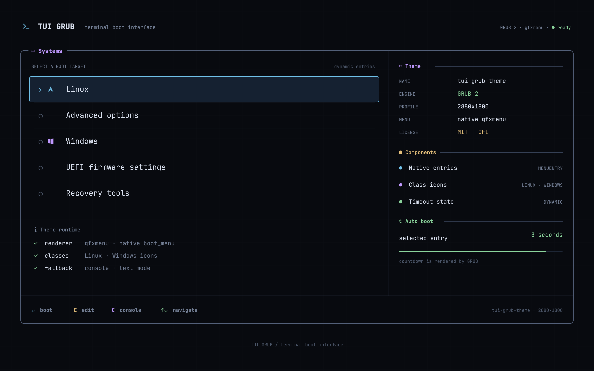
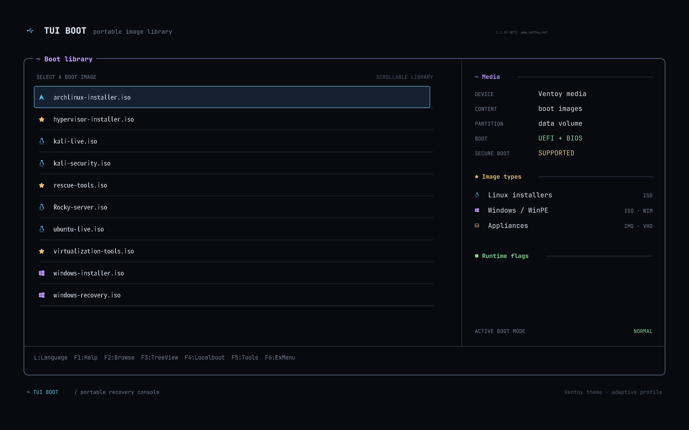

# tui-grub-theme

[English](README.md) | [简体中文](README.zh-CN.md)

A terminal-inspired GRUB 2, Plymouth, and Ventoy theme with native menus,
Nerd Font icons, restrained status colors, and reproducible build scripts.



## Features

- Native GRUB `boot_menu`, entry classes, timeout label, and progress bar.
- An optional lightweight Plymouth line animation for the kernel handoff.
- Prebuilt GRUB profiles for `2880x1800` and `2560x1600`.
- An adaptive Ventoy variant for six common 16:10, 16:9, and 4:3 modes.
- SVG sources and reproducible PNG/PF2 builds.
- Backup-first GRUB installation with generated-config validation.
- No host names, disk models, UUIDs, or machine-specific paths in the theme.

The GRUB, Plymouth, and Ventoy variants share a visual language but are
separate packages. Choose the installation section for the component you use.

## Install The GRUB Theme

This installation requires Linux with GRUB 2 already installed. It does not
install GRUB, create an EFI boot entry, or modify an EFI executable.

### 1. Choose A Resolution Profile

| Display mode | Prebuilt package | Installer option |
|---|---|---|
| `2880x1800` | `dist/tui-grub-theme/` | `--profile 2880x1800` |
| `2560x1600` | `profiles/2560x1600/dist/tui-grub-theme/` | `--profile 2560x1600` |

The default profile is `2880x1800`. Other GRUB resolutions are not currently
packaged; use the Ventoy variant when broad automatic resolution matching is
required.

### 2. Review The Installation

From the repository root:

```sh
./scripts/install.sh --profile 2880x1800 --dry-run
```

For a `2560x1600` display:

```sh
./scripts/install.sh --profile 2560x1600 --dry-run
```

The dry run lists every destination, backup path, and GRUB graphics mode
without changing the system.

### 3. Install

```sh
./scripts/install.sh --profile 2880x1800
```

Replace the profile with `2560x1600` when appropriate. The installer:

1. Backs up `/etc/default/grub`, `/boot/grub/grub.cfg`, and any existing
   `/boot/grub/themes/tui-grub-theme/` directory.
2. Installs the selected profile to `/boot/grub/themes/tui-grub-theme/`.
3. Sets `GRUB_THEME` and the matching `GRUB_GFXMODE` with an `auto` fallback.
4. Generates a temporary GRUB configuration.
5. Runs `grub-script-check` before replacing `/boot/grub/grub.cfg`.

To rebuild the selected profile before installation:

```sh
./scripts/install.sh --profile 2880x1800 --build
```

### Restore A GRUB Backup

The installer prints the exact timestamped backup paths. Restore them from
Linux or a rescue environment when necessary:

```sh
sudo cp /etc/default/grub.bak-TIMESTAMP /etc/default/grub
sudo cp /boot/grub/grub.cfg.bak-TIMESTAMP /boot/grub/grub.cfg
```

Theme failure does not remove the firmware's other EFI boot entries.

## Install The Optional Plymouth Theme

Plymouth runs after GRUB has loaded the kernel and initramfs. The companion
theme uses scripted line transforms instead of video or full-screen frame
sequences, and it never waits for an animation cycle to finish.

The following setup is for Arch Linux with `mkinitcpio`. Back up the files
before editing them:

```sh
sudo cp /etc/mkinitcpio.conf /etc/mkinitcpio.conf.bak-TIMESTAMP
sudo cp /etc/default/grub /etc/default/grub.bak-TIMESTAMP
sudo pacman -S --needed plymouth
sudo cp /etc/plymouth/plymouthd.conf /etc/plymouth/plymouthd.conf.bak-TIMESTAMP
sudo install -d /usr/share/plymouth/themes/tui-boot
sudo cp plymouth/tui-boot/* /usr/share/plymouth/themes/tui-boot/
sudo plymouth-set-default-theme tui-boot
```

Add `plymouth` immediately after `systemd` in the `HOOKS` array in
`/etc/mkinitcpio.conf`, and add `splash` to
`GRUB_CMDLINE_LINUX_DEFAULT` in `/etc/default/grub`. Then rebuild:

```sh
sudo mkinitcpio -P
sudo grub-mkconfig -o /boot/grub/grub.cfg
sudo grub-script-check /boot/grub/grub.cfg
```

The existing `quiet` and `loglevel` policy is left to the host. Press `Esc`
during Plymouth to reveal detailed boot output. A recovery entry can disable
Plymouth without rebuilding the initramfs by adding `plymouth.enable=0` and
omitting `splash` from that entry's kernel command line.

## Install The Ventoy Theme

The prebuilt Ventoy package can be deployed from Windows or Linux. Building
it from source is optional.

### Requirements

- A USB drive already prepared with Ventoy `1.1+`.
- Access to Ventoy's first, large data partition where ISO files are stored.
- Do not copy these files to the 32 MiB `VTOYEFI` partition.

### 1. Copy The Theme Directories

Copy the contents of:

```text
ventoy/dist/ventoy/theme/
```

to:

```text
Windows: E:\ventoy\theme\
Linux:  /path/to/ventoy-data/ventoy/theme/
```

Use the actual drive letter or mount point. The resulting structure must be:

```text
Ventoy data partition/
└── ventoy/
    ├── ventoy.json
    └── theme/
        ├── tui-grub-theme/
        │   └── fonts/
        ├── tui-grub-theme_2880x1800/
        ├── tui-grub-theme_2560x1600/
        ├── tui-grub-theme_1920x1200/
        ├── tui-grub-theme_1920x1080/
        ├── tui-grub-theme_1366x768/
        └── tui-grub-theme_1024x768/
```

Do not create an extra `ventoy/ventoy` or `theme/theme` directory.

Linux example:

```sh
VENTOY_ROOT=/path/to/ventoy-data
mkdir -p "$VENTOY_ROOT/ventoy/theme"
cp -R ventoy/dist/ventoy/theme/. "$VENTOY_ROOT/ventoy/theme/"
sync
```

On Windows, open `ventoy\dist\ventoy\theme` in File Explorer and copy all
seven directories into `E:\ventoy\theme\`.

### 2. Configure `ventoy.json`

If the USB drive does not already contain `ventoy/ventoy.json`, copy:

```text
ventoy/dist/ventoy/ventoy.json
```

to the USB drive's `ventoy/ventoy.json`.

If a configuration already exists, do not overwrite it. Back it up, then
merge the top-level `theme` object from the provided JSON. Merge the optional
`menu_class` array as well when custom Arch, Linux, and Windows icons are
wanted.

The provided configuration uses:

- A theme file array containing one path for every packaged resolution.
- `default_file: 0` and `resolution_fit: 1` for automatic filtering.
- A `gfxmode` list limited to resolutions that have matching themes.
- Shared high, medium, and low PF2 font tiers.

The lowercase `WIDTHxHEIGHT` string in each theme path is required by
Ventoy's resolution matching.

### 3. Verify And Eject

Before ejecting the USB drive:

1. Confirm every resolution directory contains `theme.txt`, `background.png`,
   and `icons/`.
2. Confirm `ventoy.json` is valid JSON. On Linux, run:

   ```sh
   jq empty /path/to/ventoy-data/ventoy/ventoy.json
   ```

3. Flush writes and safely eject or unmount the data partition.

Ventoy selects the matching theme automatically. Use `F5 Tools -> Theme
Select` for a temporary manual selection, or `F7` to fall back to text mode.



## Build From Source

Arch Linux dependencies:

```sh
sudo pacman -S --needed grub librsvg libxml2 jq file imagemagick \
  ttf-jetbrains-mono-nerd noto-fonts-cjk
```

Build and validate both GRUB profiles:

```sh
make build
make check
```

Rebuild and validate the Plymouth assets:

```sh
make build-plymouth
make check-plymouth
```

Build and validate the adaptive Ventoy package:

```sh
make build-ventoy
make check-ventoy
```

The scripts use Fontconfig to locate JetBrainsMono Nerd Font Mono and Noto
Sans Mono CJK SC. Font files can be supplied explicitly with
`NERD_FONT_FILE`, `CJK_FONT_FILE`, and `CJK_FONT_INDEX`.

## Preview

With `grub2-theme-preview`, QEMU, OVMF, mtools, and xorriso installed:

```sh
make preview
```

An alternative resolution can be passed to the preview wrapper:

```sh
RESOLUTION=2560x1600 ./scripts/preview.sh --no-kvm
```

## Repository Layout

```text
.
├── assets/screenshots/                 # GRUB preview images
├── dist/tui-grub-theme/                # Default 2880x1800 GRUB package
├── profiles/2560x1600/                 # Generic 2560x1600 GRUB profile
├── plymouth/                            # Optional animated boot handoff
├── scripts/                             # Build, check, install, and preview
├── src/                                 # Default GRUB SVG/theme sources
├── ventoy/src/                          # Adaptive Ventoy sources
├── ventoy/dist/ventoy/                  # Deployable Ventoy package
└── .github/workflows/                   # Continuous validation
```

## Dynamic And Static Content

Menu entries, class icons, the selected state, and the countdown are rendered
by native GRUB components. The background contains only generic theme and
component information; it does not encode host names, disk models, UUIDs, or
boot entry names.

The default GRUB background has five visual menu rows. GRUB can scroll when
more entries exist, but a layout change should keep the background separators,
`boot_menu` height, and item height aligned.

## License

Theme source code is licensed under [MIT](LICENSE). Generated PF2 fonts and
font-derived icon assets retain their upstream SIL OFL 1.1 terms; see
[THIRD_PARTY_NOTICES.md](THIRD_PARTY_NOTICES.md).
